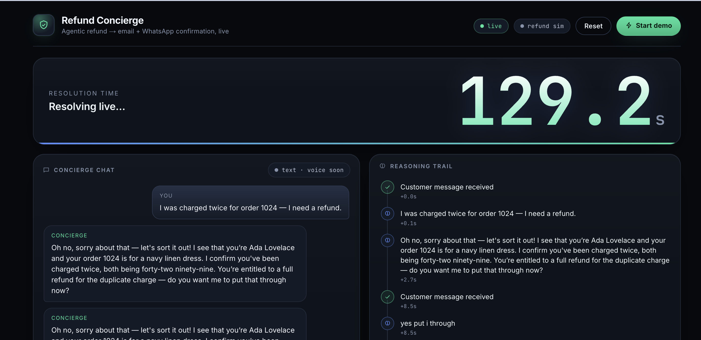
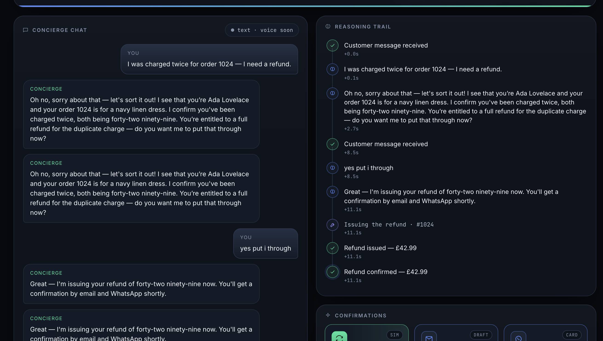
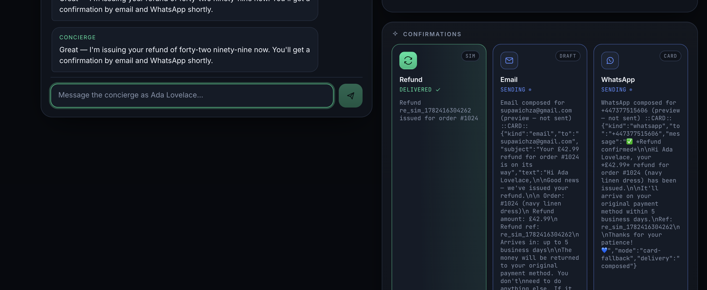
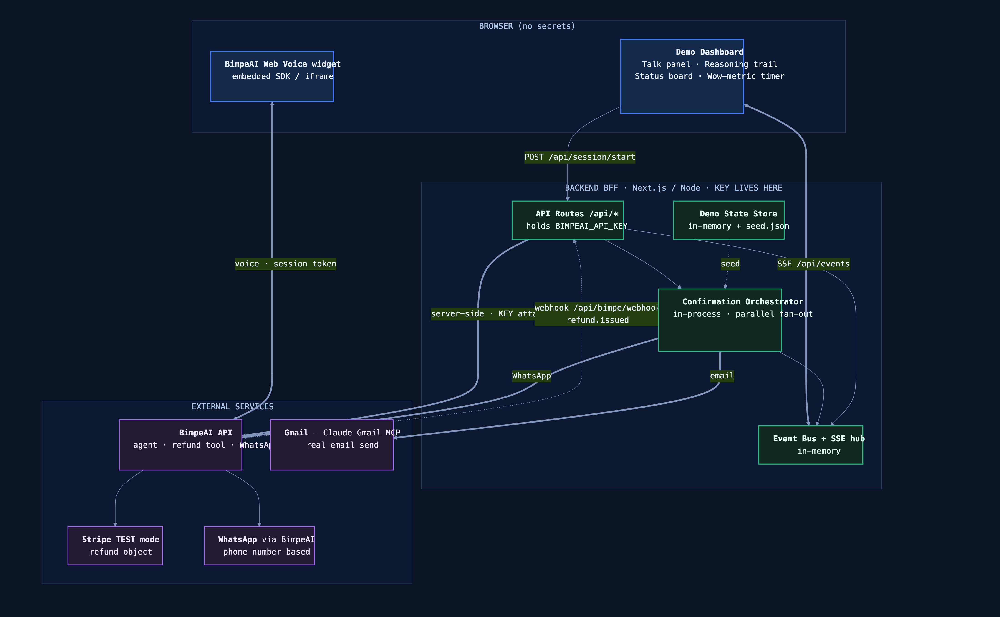

# 🤖 Refund Concierge

> **Chatbots answer. Action Agents act.**

A voice/chat AI agent that **resolves a customer's refund and issues it** — then confirms across **email + WhatsApp** — in about 40 seconds. Built on [BimpeAI](https://bimpe.ai), wrapped in a live Next.js dashboard.

Built at the **London Agentic AI Hack Night** (25 June 2026).



---

## What it is

Most "AI" in customer support is a FAQ bot: it *tells* you a refund is coming and hands off to a human. Refund Concierge is an **action agent** — it does the thing.

A customer talks to it → it recognizes the order, verifies the duplicate charge against policy, **issues the refund**, and fires two confirmation channels — while a live dashboard shows every step and a timer lands on **~40 seconds**.

An anti-abuse policy envelope (order/customer match, amount ceiling, return-window, human escalation) stops it over-refunding.

## See it run

| Conversation + reasoning trail | Confirmations fan-out |
|---|---|
|  |  |

**Golden path:** customer **Ada**, order **#1024**, navy linen dress, **£42.99**, *"I was charged twice."* → the agent recognizes her, issues the refund, confirms by email + WhatsApp.

> Verified live: the agent recognizes the order and reaches its refund decision reliably (3/3 runs), and **refuses out-of-policy requests** — ask for £200 and it offers only the legitimate £42.99.

## How it works



- **Conversation:** the **BimpeAI** agent (webchat API) — live, synchronous replies. The agent's system prompt + knowledge base were applied via the BimpeAI API.
- **App:** a single **Next.js 14** dashboard with an in-process BFF, so the API key stays server-side. Real-time UI via **Server-Sent Events**.
- **Refund:** Stripe (TEST mode) — a real refund object when keys are connected, or a clearly-labeled simulated `re_sim_*` (the dashboard always shows which mode).
- **Confirmations:** an orchestrator fans out **email (Gmail)** + **WhatsApp** on the refund event, idempotently.
- **Demo-safety:** every external call carries a `mode` flag (real vs simulated render identically green), and `DEMO_MODE=replay` plays the whole golden path with **zero network** as an on-stage fallback.

## Features

- 🎙️ Conversational refund resolution (chat now; Web Voice is a one-click upgrade)
- 💳 Refund-as-an-action — the agent moves money, it doesn't file a ticket
- 📧 + 📱 Two-channel confirmation (email + WhatsApp)
- 📊 Live dashboard: talk panel · reasoning trail · status board · wow-metric timer
- 🛡️ Anti-abuse policy envelope + human escalation
- 🎬 `DEMO_MODE=replay` deterministic fallback — the demo can't die on stage

## Tech stack

`BimpeAI` (agent · webchat · Stripe · multichannel) · `Next.js 14` / `TypeScript` · `Server-Sent Events` · `Stripe` (TEST) · `Gmail` · `WhatsApp`

## Run locally

```bash
cp .env.local.example .env.local     # add BIMPE_AGENT_ID + your demo customer
npm install
PORT=3100 npm run dev                # → http://localhost:3100
```

Open the dashboard → **Start** → type *"refund for order 1024 — navy linen dress, charged twice"* → watch **Refund → Email → WhatsApp** turn green.

On-stage fallback (no network): set `DEMO_MODE=replay`, then `POST /api/demo/replay`.

### What's real vs flag-gated (honest)

| Capability | Default | Make it real |
|---|---|---|
| Conversation (webchat) | ✅ live | — |
| Refund | simulated `re_sim_*` (looks identical) | add Stripe TEST keys |
| Email | composed preview | add SMTP app-password |
| WhatsApp | on-dashboard card | connect WhatsApp in BimpeAI + open the 24h window |
| Voice | off | enable Web Voice in the BimpeAI dashboard |

## Project structure

```
refund-concierge/
├─ app/                  # Next.js dashboard — talk panel · reasoning trail · status board · wow metric
│  └─ api/               # the BFF: session, message, refund, events (SSE), health
├─ server/
│  ├─ bff/               # BimpeAI webchat client + in-process event bus + refund execution
│  ├─ orchestrator/      # email + WhatsApp confirmation fan-out
│  └─ config.ts          # feature flags + mode auto-detection (server-only)
├─ shared/               # shared types + event contracts
├─ seed.json             # the seeded demo customer + order
└─ docs/                 # architecture, demo runbook, pitch deck/script, figures, use-case catalog
```

## Docs

- [`docs/ARCHITECTURE.md`](docs/ARCHITECTURE.md) — full system design
- [`docs/DEMO-RUNBOOK.md`](docs/DEMO-RUNBOOK.md) — beat-by-beat demo script
- [`docs/USE-CASE-CATALOG.md`](docs/USE-CASE-CATALOG.md) — the 12-use-case product line
- [`docs/SUBMISSION.md`](docs/SUBMISSION.md) — hackathon submission writeup
- `docs/PITCH-DECK.pdf` · `docs/PITCH-SCRIPT.md` · `docs/figures/`

## License

[MIT](LICENSE)

---

*Built on BimpeAI at the London Agentic AI Hack Night, 25 June 2026. Statistics cited in the pitch materials are labeled industry estimates/forecasts, not audited figures.*
