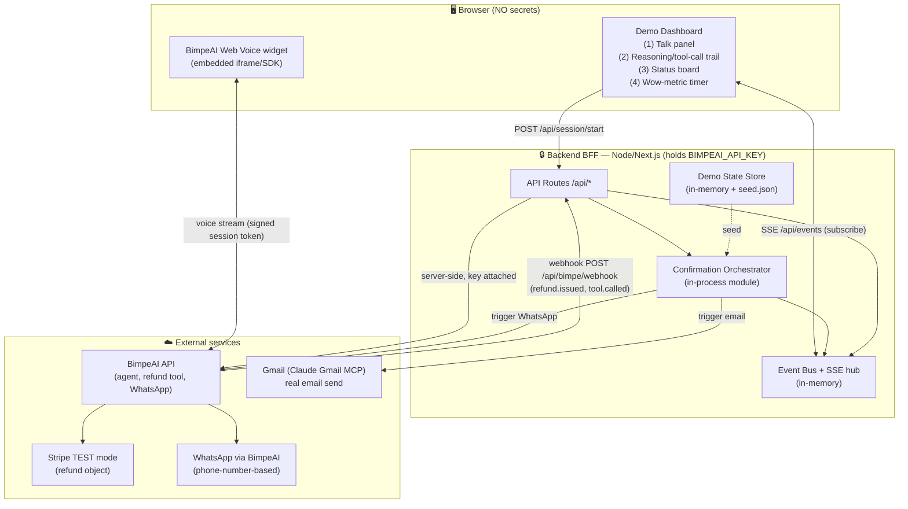

# Voice Refund Concierge — Build-Ready Architecture Spec

**Demo target:** 3-minute live judge demo. Bias: *cannot crash*. Flagrant BimpeAI usage.
**One-liner:** Customer speaks to a BimpeAI voice agent → refund issued → email + WhatsApp fire → dashboard lights up → "Refunded in ~40s."

---

## 1. Component Diagram



**Key locality:** `BIMPEAI_API_KEY` lives only in the BFF process env. The browser never sees it. The voice widget authenticates with a short-lived, server-minted **session token** (not the API key). All BimpeAI control-plane calls (clone workflow, send WhatsApp, read events) are server-to-server.

---

## 2. Tech Stack Pick

**Single Next.js 14 app (App Router) + TypeScript + Tailwind.** One repo, one `npm run dev`, one screen-shareable URL (`localhost:3000`).

- **Why Next.js:** API routes (`app/api/*`) give us the BFF *in the same process* as the React dashboard — no separate server to start, no CORS, secrets stay in route handlers. The Confirmation Orchestrator is just a server module imported by routes. Deploy = one `vercel deploy` (optional).
- **Real-time:** **SSE** (`text/event-stream`), not WebSocket. SSE is one-directional (server→dashboard), trivial in a Next route handler, auto-reconnects, and survives a flaky venue network better than a WS upgrade. The dashboard only *consumes* events; it sends commands via plain POST.
- **State:** in-memory `Map` + a `seed.json`. No DB — a hackathon demo with one customer/order does not need Postgres, and a DB is one more thing that can fail on stage.
- **Voice:** BimpeAI Web Voice embedded widget (one-click enabled in BimpeAI dashboard). Conversation-driven; customer initiates.

Tradeoff: in-memory state dies on restart — acceptable and *desirable* for a demo (clean reset between runs via `POST /api/admin/reset`).

---

## 3. Golden-Path Sequence (end to end)

1. **Operator** opens dashboard, clicks **"Start demo"** → `POST /api/session/start`. BFF resets state from `seed.json` (customer "Ada", order #1024, $42.00), mints a voice session token, returns it. Dashboard opens SSE to `/api/events` and arms the wow-metric timer (`t0` recorded on first user utterance).
2. **User speaks** into the Web Voice widget: *"I want a refund for order 1024."* Voice streams to **BimpeAI** directly (token-auth).
3. **BimpeAI agent reasons** over the inline KB (seeded customer/order, refund policy ≤2500 chars). Each reasoning step / tool decision is mirrored to the BFF via the BimpeAI **webhook** (`tool.called`, `agent.reasoning`) → pushed to dashboard trail. *Data source: BimpeAI webhook payload.*
4. **Agent issues refund** by calling its `issue_refund` action → Stripe TEST refund (or simulated, see §5). BimpeAI POSTs `refund.issued {orderId, amount, refundId}` to `POST /api/bimpe/webhook`. *Data source: Stripe refund object id, or simulated id `re_sim_*`.*
5. **BFF catches the refund event**, validates it, emits `refund.confirmed` on the bus → dashboard **Refund card → green**. BFF immediately invokes the **Confirmation Orchestrator** with the refund context.
6. **Orchestrator fans out two confirmations in parallel:**
   - **Email** via Claude **Gmail MCP** → real email to Ada's address from seed. On success emits `email.sent`. *Data: seed email + refund details.*
   - **WhatsApp** via **BimpeAI** outbound (phone-number-based, `is_test_call`-style send) to seeded number. On success emits `whatsapp.sent`. *Data: seed phone + refund details.*
7. **Dashboard status board** lights **Email card → green**, then **WhatsApp card → green** as each event arrives over SSE.
8. **Wow-metric:** on `whatsapp.sent` (last confirmation), dashboard stops the timer and renders **"Refunded + confirmed in ~40s"** big. Demo complete.

---

## 4. Interfaces / Contracts (3 parallel build agents work without colliding)

**Module ownership:** Agent A = `web/` (dashboard UI). Agent B = `server/bff/` (routes + BimpeAI client + webhook). Agent C = `server/orchestrator/` (email/WhatsApp fan-out). The **shared contract** below is frozen so they don't collide.

### BFF endpoints (Agent B)
| Method | Path | Body | Returns |
|---|---|---|---|
| POST | `/api/session/start` | `{}` | `{ sessionToken, seed }` |
| GET | `/api/events` | — (SSE) | event stream (below) |
| POST | `/api/bimpe/webhook` | BimpeAI payload | `204` |
| POST | `/api/admin/reset` | `{}` | `{ ok:true }` |
| GET | `/api/health` | — | `{ ok, flags }` |

### SSE event envelope (the dashboard subscribes to this — Agent A consumes, B+C emit)
```
event: <type>
data: { "type": "...", "ts": <ms>, "payload": {...}, "demoId": "..." }
```
`type ∈ { agent.reasoning, tool.called, refund.confirmed, email.sent, whatsapp.sent, error, heartbeat }`.
- `refund.confirmed.payload`: `{ orderId, amount, refundId, mode: "stripe"|"simulated" }`
- `email.sent.payload`: `{ to, messageId, mode: "live"|"skipped" }`
- `whatsapp.sent.payload`: `{ to, mode: "live"|"card-fallback" }`
- `heartbeat` every 15s so the dashboard never shows a dead connection.

### Orchestrator trigger (Agent C exposes; Agent B calls)
```ts
// server/orchestrator/index.ts
runConfirmations(ctx: RefundContext): void   // fire-and-forget; emits via bus
// RefundContext = { orderId, amount, refundId, customer:{name,email,phone}, mode }
```
Orchestrator emits `email.sent` / `whatsapp.sent` / `error` on the **same bus** the SSE hub reads. Email and WhatsApp run on independent promises — one failing never blocks the other.

### Shared types (single source of truth, no collision)
`shared/types.ts` (events, RefundContext, Seed) + `shared/events.ts` (the in-process EventEmitter the SSE route and orchestrator both import). Agents A/B/C all import from `shared/`; nobody redefines.

---

## 5. Degradation / Fallback (config flags, never a rewrite)

All flags in `server/config.ts`, read from env at boot, surfaced on `/api/health` and a small dashboard "demo mode" badge:

| Flag | Default | When off → fallback |
|---|---|---|
| `STRIPE_CONNECTED` | auto-detect key | **Simulated refund:** Orchestrator skips Stripe, mints `re_sim_<ts>`, emits `refund.confirmed{mode:"simulated"}`. Dashboard shows identical green card + tiny "TEST/SIM" tag. |
| `WHATSAPP_CONNECTED` | auto-detect | **On-dashboard WhatsApp card:** render a realistic WhatsApp-style message bubble in the status board + note "sent to +44…"; emit `whatsapp.sent{mode:"card-fallback"}`. Visually indistinguishable to judges from a real send. |
| `EMAIL_LIVE` | true if Gmail MCP reachable | Skip real send, emit `email.sent{mode:"skipped"}`, show the would-be email body on the dashboard. |
| `FALLBACK_VIDEO` | false | If set, dashboard **"Play recorded run"** button plays a pre-recorded flawless run (`/public/fallback.mp4`) full-screen — the ultimate "cannot crash" hook if the venue network dies entirely. |

Design rule: **every external dependency has a `mode` field on its success event**, so the dashboard renders the same UI whether live or faked. The demo *looks identical* in degraded mode. Build agents implement both branches behind the flag from day one — no last-minute rewrite.

---

## 6. Secrets Handling

- `BIMPEAI_API_KEY`, Stripe test key, and any Gmail/WhatsApp creds live in `.env.local` (gitignored), loaded by Next.js **only in server route handlers** (no `NEXT_PUBLIC_` prefix → physically excluded from the client bundle).
- The browser's voice widget uses a **short-lived session token** minted by `/api/session/start`, scoped to one demo session — never the API key.
- All BimpeAI control-plane calls (workflow clone, WhatsApp send) and the webhook handler run server-side. Webhook authenticity verified via a shared `BIMPE_WEBHOOK_SECRET` (HMAC or bearer check) so a stray POST can't spoof a refund.
- A boot-time assertion fails loudly if any `NEXT_PUBLIC_*` var contains a key-like string. CI/grep check: no key may appear under `web/`.

---

## 7. File / Module Layout (one module per build agent)

```
voice-refund-concierge/
├── app/
│   ├── page.tsx                  # Dashboard shell                 [Agent A]
│   ├── components/               # TalkPanel, ReasoningTrail,
│   │   ├── TalkPanel.tsx         #   StatusBoard, WowMetric        [Agent A]
│   │   ├── ReasoningTrail.tsx
│   │   ├── StatusBoard.tsx
│   │   └── WowMetric.tsx
│   ├── hooks/useEventStream.ts   # SSE client                      [Agent A]
│   └── api/
│       ├── session/start/route.ts                                 [Agent B]
│       ├── events/route.ts       # SSE hub                         [Agent B]
│       ├── bimpe/webhook/route.ts                                  [Agent B]
│       ├── admin/reset/route.ts                                    [Agent B]
│       └── health/route.ts                                         [Agent B]
├── server/
│   ├── bff/bimpeClient.ts        # BimpeAI API wrapper (key here)  [Agent B]
│   ├── orchestrator/index.ts     # runConfirmations fan-out        [Agent C]
│   ├── orchestrator/email.ts     # Gmail MCP send                  [Agent C]
│   ├── orchestrator/whatsapp.ts  # BimpeAI WhatsApp send           [Agent C]
│   ├── config.ts                 # flags (shared, frozen early)    [Agent B]
│   └── seed.json                 # Ada / order #1024 / $42         [shared]
├── shared/
│   ├── types.ts                  # frozen contract                 [all]
│   └── events.ts                 # in-process bus                  [all]
├── public/fallback.mp4           # recorded run                    [demo-eng]
└── .env.local                    # secrets (gitignored)
```

**Build order / dependencies:** freeze `shared/types.ts` + `shared/events.ts` + `server/config.ts` + `seed.json` **first** (15 min, all agents agree). Then A/B/C build in parallel against the contract. Manual/dashboard-only steps (enable Web Voice, connect Stripe/WhatsApp in BimpeAI console) are a **one-time human checklist**, and every one has a flag fallback so the build is never blocked waiting on them.

---

**Next:** hand to `/spec` per module for the build plan. Bottleneck = the BimpeAI webhook→bus→SSE path; everything else is cosmetic. Demo-safety = the `mode` field on every success event + the fallback video.
```
